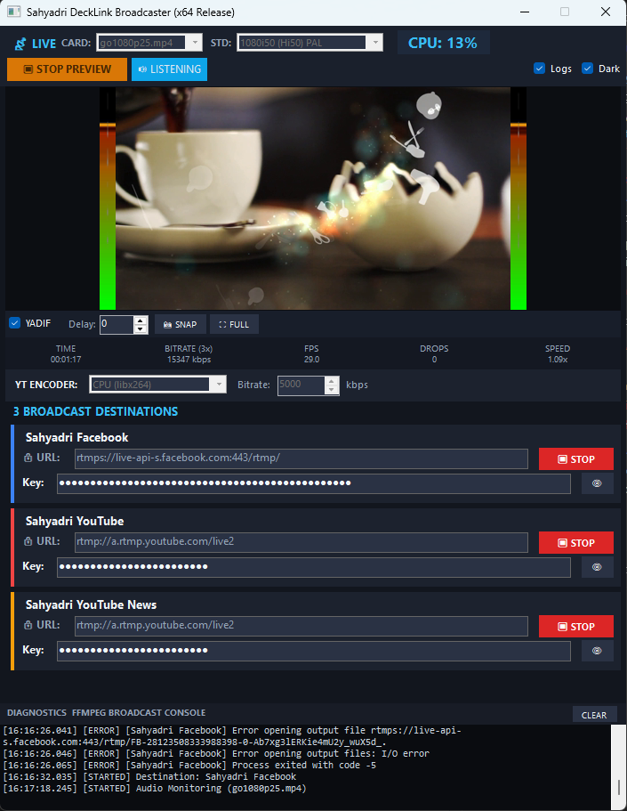

# Channel DeckLink Broadcaster (.NET 10 x64 Release)



High-performance broadcast streaming desktop application for Windows x64. Ingests a **single Blackmagic DeckLink SDI/HDMI source** and broadcasts simultaneously to **3 destinations**:
1. **Channel Facebook**
2. **Channel YouTube**
3. **Channel YouTube News**


-purple)


---

## 🌟 Key Features

- **Single DeckLink Input Source**:
  - Direct hardware capture via official Blackmagic DeckLink SDK (`DeckLinkAPI.Interop.dll`).
  - Supports `DeckLink SDI 4K`, `DeckLink Duo (1-4)`, `DeckLink Quad`, and `UltraStudio`.
  - Default broadcast video standard: `1080i50 (Hi50)` with optional real-time YADIF deinterlacing.
  - 48kHz embedded SDI audio with millisecond sync delay compensation (`Audio Delay: 0 ms`).
  - Audio Listen: route SDI audio to PC headphones/speakers for operator monitoring.

- **3 Simultaneous Streaming Destinations**:
  - **Channel Facebook**: `rtmps://live-api-s.facebook.com:443/rtmp/`
  - **Channel YouTube**: `rtmp://a.rtmp.youtube.com/live2`
  - **Channel YouTube News**: `rtmp://a.rtmp.youtube.com/live2`
  - Encodes video **only once** on the GPU/CPU and distributes to all 3 endpoints via high-throughput FLV tee muxer with `[onfail=ignore]` fault isolation.
  - Individual enable/disable checkboxes and masked Stream Keys with eye reveal toggle.

- **Operator Preview Canvas & Audio VU Meters**:
  - Crisp 16:9 Live Video Monitor.
  - Left & Right Stereo Peak-Hold Audio VU Meters directly beside the video preview.
  - Standby Preview mode to check camera feed and audio levels before pushing live.
  - Fullscreen pop-out monitor (double-click video preview or click `⛶ FULLSCREEN`).
  - Frame snapshot capture button (`📸 SNAPSHOT`).

- **Hardware GPU Acceleration**:
  - **NVIDIA NVENC (`h264_nvenc`)**: Zero-latency GPU encoding (`-preset ll -tune ll -zerolatency 1`, 2-second GOP).
  - CPU software fallback (`libx264`).
  - Configurable bitrate (1500 to 30000 kbps).

- **Persistent Settings (Outside Project Folder)**:
  - Settings are stored strictly in `%APPDATA%\DeckLinkStreamStudio\settings.json`.
  - No settings files are written to or maintained within the project directory.

- **Strict 64-Bit Release Build**:
  - Built exclusively for 64-bit Windows in Release mode (`bin\Release\net10.0-windows\win-x64\DeckLinkStreamStudio_*.exe`).

---

## 🚀 Running the Broadcaster

Launch the generated Release executable:
```powershell
.\bin\Release\net10.0-windows\win-x64\DeckLinkStreamStudio_*.exe
```

To re-compile the 64-bit Release binary:
```powershell
dotnet build -c Release
```
